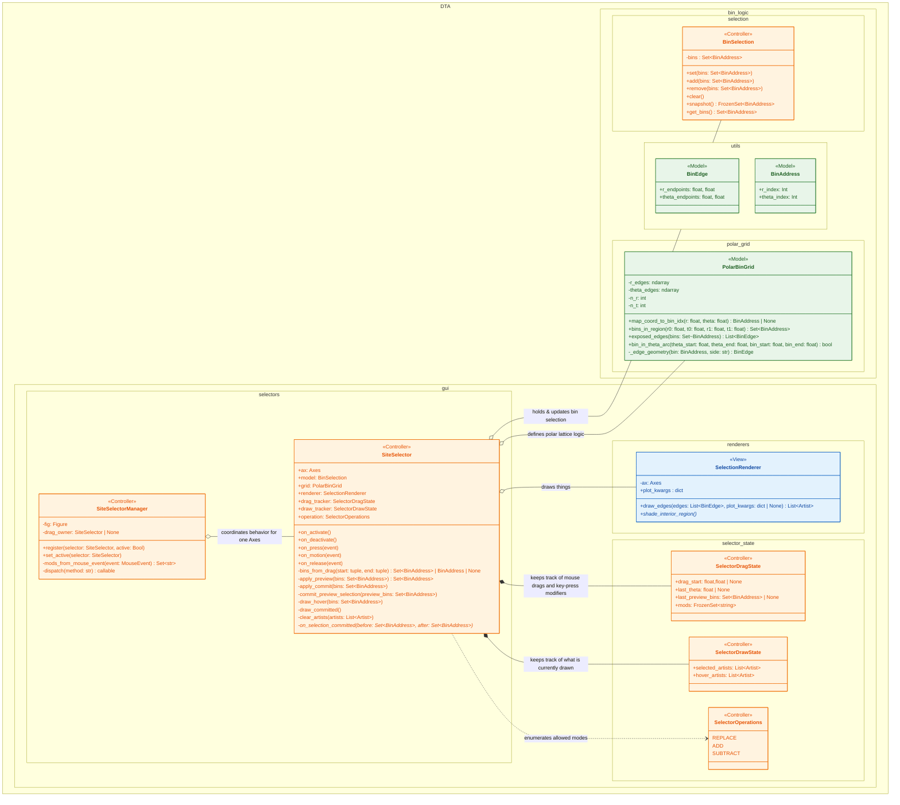
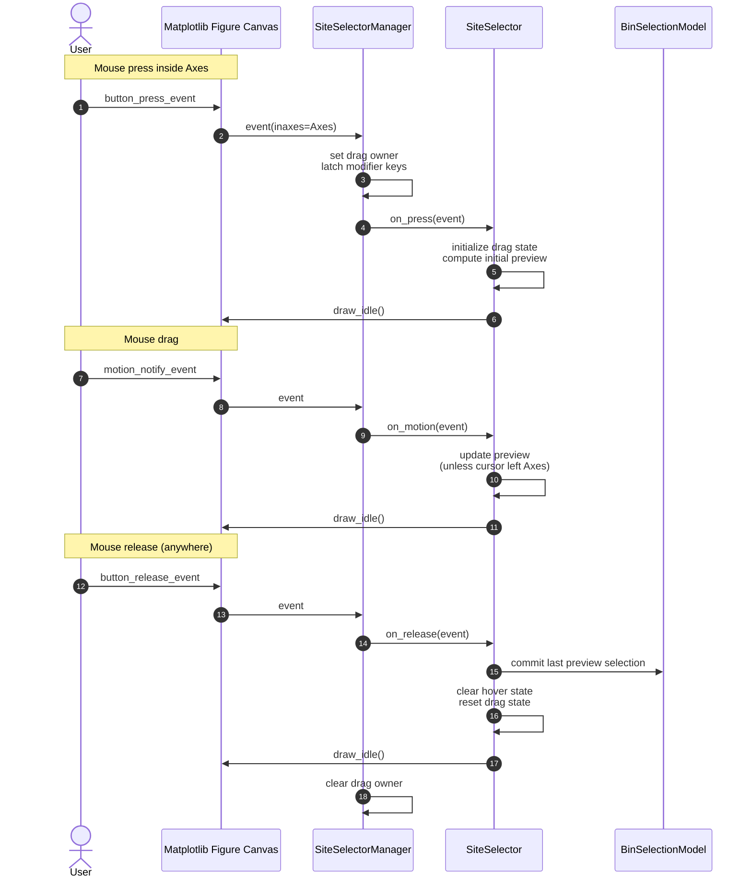

# Python Package Architecture

This folder contains the core Python implementation for interactive polar-bin selection using Matplotlib.  
The code is designed for **interactive environments** (including Jupyter notebooks with widget backends) and emphasizes **correctness, debuggability, and separation of concerns**.

---

## Overview

The system allows a user to:

- Interactively select polar bins using click-and-drag gestures
- Add to, subtract from, or replace selections using modifier keys
- Drag outside an Axes and still commit the selection correctly
- Work with multiple Axes in the same Figure without state leakage

To support this reliably, the code is organized using a **Model–View–Controller (MVC)** architecture.

---

## Model–View–Controller (MVC)

### Roles

- **Model**  
  Owns domain state and pure geometry rules.  
  Has no knowledge of Matplotlib events or rendering.

- **View**  
  Responsible only for drawing on Matplotlib Axes.  
  Does not encode selection semantics.

- **Controller**  
  Translates user input (mouse + modifiers) into model updates and view updates.  
  Owns all gesture and interaction state.

---

## MVC Class Diagram

## Sequence Diagram Depicting User Actions and Code Response

## Where to change what
| If you want to change…                     | Edit this class                                |
| ------------------------------------------ | ---------------------------------------------- |
| Which bins are selected by a drag          | `PolarBinGrid`                                 |
| How angular wraparound works               | `PolarBinGrid.bin_in_theta_arc`                |
| How selection state is stored              | `BinSelectionModel`                            |
| How outlines are drawn                     | `PolarBinRenderer`                             |
| Selection semantics (replace/add/subtract) | `SiteSelector`                                 |
| Modifier-key behavior                      | `SiteSelectorManager._mods_from_mouse_event`   |
| Drag ownership / event routing             | `SiteSelectorManager`                          |
| Hover vs committed rendering               | `SiteSelector`                                 |
| Undo/redo behavior                         | Override `SiteSelector.on_selection_committed` |
