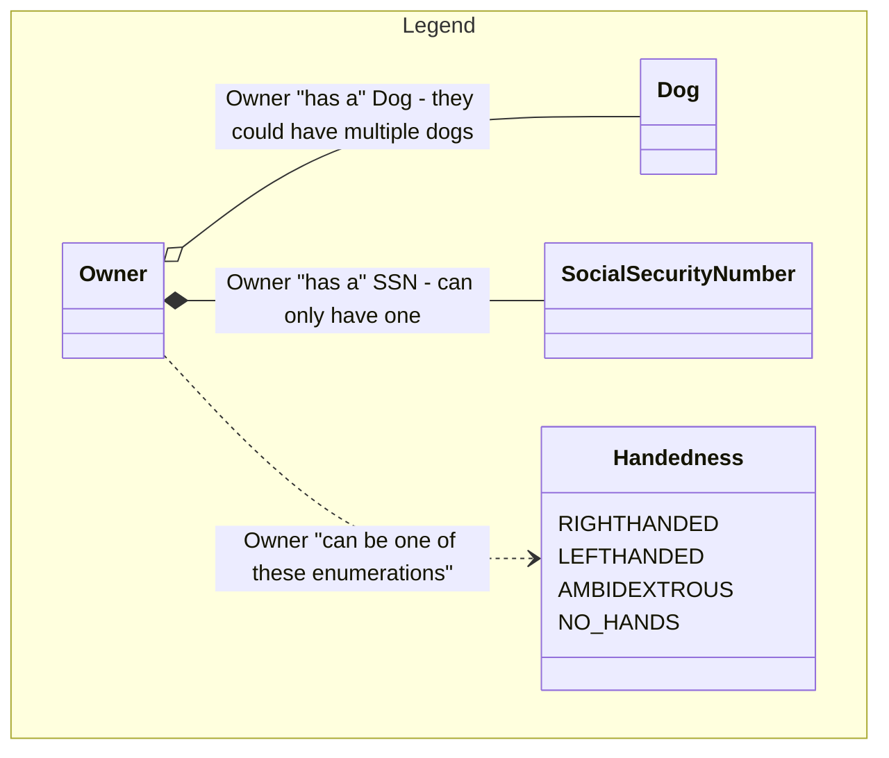
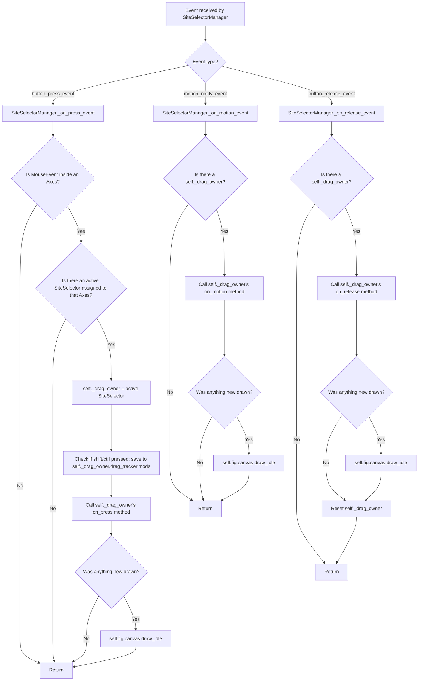

# Python Package Architecture

This folder contains the core Python implementation for interactive polar-bin selection using Matplotlib.  

---

## Overview

The system allows a user to:

- Interactively select polar bins using click-and-drag gestures
- Add to, subtract from, or replace selections using modifier keys
- Drag outside an Axes and still commit the selection correctly
- Work with multiple Axes in the same Figure without state leakage

To support this reliably, the code is organized using a **Model–View–Controller (MVC)** architecture.

---

## Model–View–Controller (MVC)

### Roles

- **Model**  
  Owns domain state and pure geometry rules.  
  Has no knowledge of Matplotlib events or rendering.

- **View**  
  Responsible only for drawing on Matplotlib Axes.

- **Controller**  
  Translates user input (mouse + modifiers) into model updates and view updates.  
  Owns all gesture and interaction state.

---

## MVC Class Diagram

```mermaid
classDiagram

%% =========================
%% MVC Stereotypes
%% =========================

class PolarBinGrid:::model
class GridDim:::model
class BinAddress:::model
class Coordinate:::model
class BinEdge:::model
class BinSelection:::model

class SelectionRenderer:::view

class SiteSelector:::controller
class SiteSelectorManager:::controller
class SelectorDragState:::controller
class SelectionOperations:::controller

<<Model>> PolarBinGrid
<<Model>> GridDim
<<Model>> BinAddress
<<Model>> Coordinate
<<Model>> BinEdge
<<Model>> BinSelection

<<View>> SelectionRenderer

<<Controller>> SiteSelector
<<Controller>> SiteSelectorManager
<<Controller>> SelectorDragState
<<Controller>> SelectionOperations


%% =========================
%% Model
%% =========================

namespace DTA.bin_logic.polar_grid {
class PolarBinGrid {
    +r: GridDim
    +theta: GridDim
    +r_grid: ndarray
    +theta_grid: ndarray
    +map_coord_to_bin_idx(coord: Coordinate) BinAddress | None
    +bins_in_region(corner1: Coordinate, corner2: Coordinate, crosses_theta_boundary: bool) Set~BinAddress~
    +list_all_exposed_edges(bins: Set~BinAddress) List~BinEdge~
    +calc_bin_area(bin_address: BinAddress) float
    -determine_exposed_bin_edges(mask: ndarray, bin_address: BinAddress) list~BinEdge~
    -determine_bin_edge(bin_address: BinAddress, side: str) BinEdge
}
class GridDim {
    +lower_bound: float
    +upper_bound: float
    +n_bins: int
    +bin_width: float
    +bin_edges: ndarray
}
}

namespace DTA.bin_logic.utils {
class NamedTuple {}
class BinAddress {
    +r_index: Int
    +theta_index: Int
}
class Coordinate {
    +r_coord: float
    +theta_coord: float
}
class BinEdge {
    +endpoint1: Coordinate
    +endpoint2: Coordinate
}
}
namespace DTA.bin_logic.bin_selection {
class BinSelection {
    +bins : Set~BinAddress~
    -selection_history*
    +set_bins(bins: Set~BinAddress~)
    +get_bins() Set~BinAddress~
    +reset()
    +undo()*
    +redo()*
}
}

%% =========================
%% View
%% =========================
namespace DTA.gui.renderers {
class SelectionRenderer {
    +ax: Axes
    +plot_kwargs : dict
    +selected_artists: List~Artist~
    +hover_artists: List~Artist~
    +draw_edges(edges: List~BinEdge~, plot_kwargs: dict | None) List~Artist~
    +shade_interior_region()*
}
class matplotlib.axes.Axes {}
}

%% =========================
%% Controller
%% =========================

namespace DTA.gui.selector_state {
class SelectionOperations {
    <<enumeration>>
    REPLACE
    ADD
    SUBTRACT
}

class SelectorDragState {
    <<dataclass>>
    -drag_start: Coordinate | None
    -last_theta: float | None
    -operation: SelectionOperation
    +start_drag() None
    +reset() None
}
}

namespace DTA.gui.selectors {
class SiteSelector {
    +selection: BinSelection
    +grid: PolarBinGrid
    +renderer: SelectionRenderer
    +drag_tracker: SelectorDragState
    +current_preview_bins: Set~BinAddress~ | None
    +on_activate() None
    +on_press(event: MouseEvent, operation: SelectionOperation) bool
    +on_motion(event: MouseEvent) bool
    +on_release(_event: MouseEvent) bool
    +on_deactivate() None
    -calculate_preview_bins(bins: Set~BinAddress~) Set~BinAddress~
    -draw_preview(bins: Set~BinAddress~) None
    -draw_selection() None
    -clear_artists(artists: List~Artist~) None
    -save_to_selection_history(last_bins: Set~BinAddress~)*
}

class SiteSelectorManager {
    +fig: Figure
    -selectors: dict
    -active: dict
    -drag_owner: SiteSelector | None
    -cids: List~int~
    +register(selector: SiteSelector, active: bool)
    +set_active(selector: SiteSelector)
    -on_press_event(event: MouseEvent)
    -on_motion_event(event: MouseEvent)
    -on_release_event(event: MouseEvent)
    -mods_from_mouse_event(event: MouseEvent) Set~str~
    -determine_operation_from_key_presses(event: MouseEvent) SelectionOperation
}
class matplotlib.figure.Figure {}
}
%% =========================
%% Relationships
%% =========================

SiteSelector *-- PolarBinGrid : defines polar lattice logic
SiteSelector *-- SelectionRenderer : draws things & keeps track of what's drawn
SiteSelector *-- BinSelection : holds & updates bin selection
SiteSelector *-- SelectorDragState : keeps track of mouse drags and key-press modifiers
SelectorDragState ..> SelectionOperations : enumerates allowed modes

SelectionRenderer *-- matplotlib.axes.Axes

SiteSelectorManager o-- SiteSelector : coordinates behavior for one Axes
SiteSelectorManager *-- matplotlib.figure.Figure

NamedTuple <|-- BinAddress : is a
NamedTuple <|-- Coordinate : is a
NamedTuple <|-- BinEdge : is a

PolarBinGrid o-- GridDim

%% =========================
%% Styling (MVC color coding)
%% =========================
classDef model fill:#E8F5E9,stroke:#2E7D32,stroke-width:1px,color:#1B5E20;
classDef view fill:#E3F2FD,stroke:#1565C0,stroke-width:1px,color:#0D47A1;
classDef controller fill:#FFF3E0,stroke:#EF6C00,stroke-width:1px,color:#E65100;
```

## Sequence Diagram Depicting User Actions and Code Response

